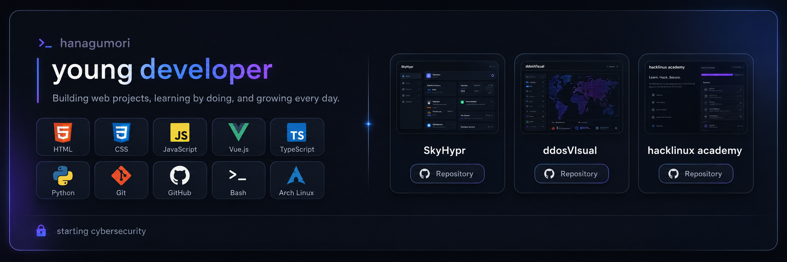
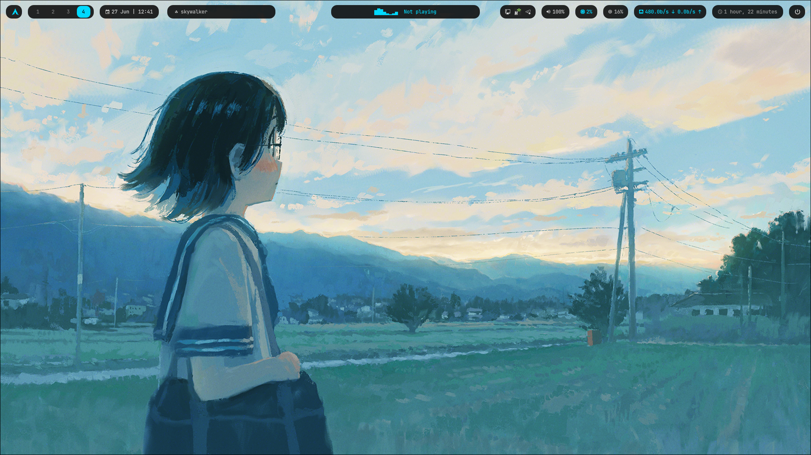
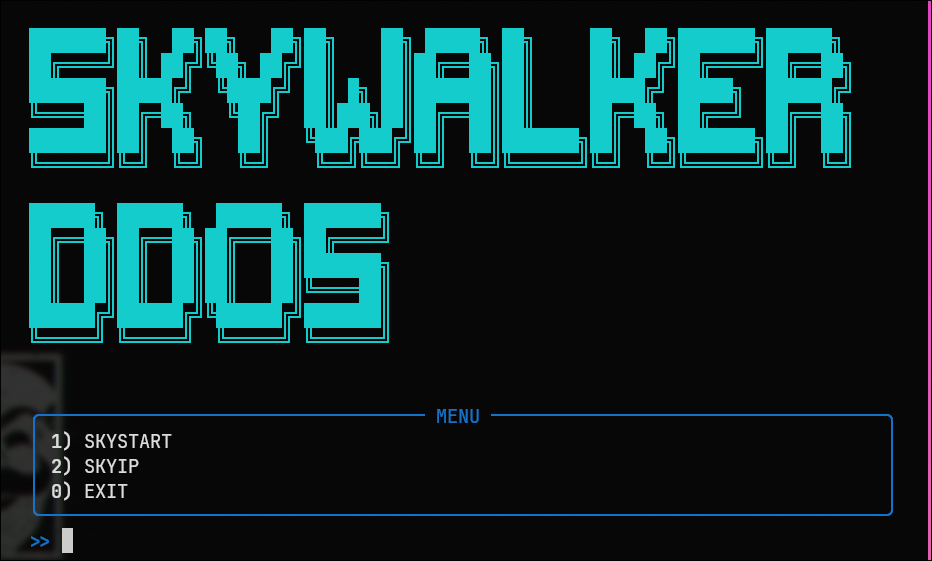
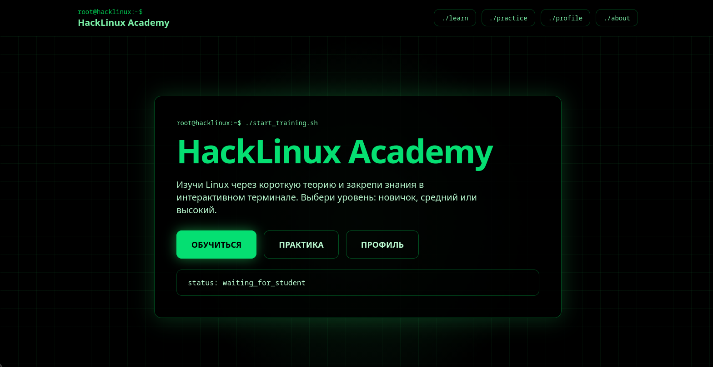

# hanagumori

 

## ‹› Languages & Tools

<table>
  <tr>
    <td align="center" width="96">
      
       
      HTML
    </td>
    <td align="center" width="96">
      
       
      CSS
    </td>
    <td align="center" width="96">
      
       
      JavaScript
    </td>
    <td align="center" width="96">
      
       
      Vue.js
    </td>
    <td align="center" width="96">
      
       
      TypeScript
    </td>
  </tr>
  <tr>
    <td align="center" width="96">
      
       
      Python
    </td>
    <td align="center" width="96">
      
       
      Git
    </td>
    <td align="center" width="96">
      
       
      GitHub
    </td>
    <td align="center" width="96">
      
       
      Bash
    </td>
    <td align="center" width="96">
      
       
      Arch Linux
    </td>
  </tr>
</table>

 

## ▱ Projects

<table align="center">
  <tr>
    <td width="280" align="center" valign="top">
      
        
      
    </td>
    <td width="280" align="center" valign="top">
      
        
      
    </td>
    <td width="280" align="center" valign="top">
      
        
      
    </td>
  </tr>
</table>

 

## ✦ Get in touch

 

## Cybersecurity

I’m starting to study cybersecurity.  
If you have experience and can help me learn, feel free to contact me.

 

still learning. still building.

