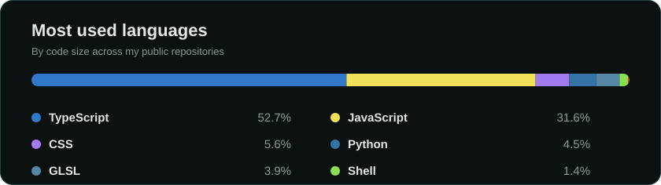
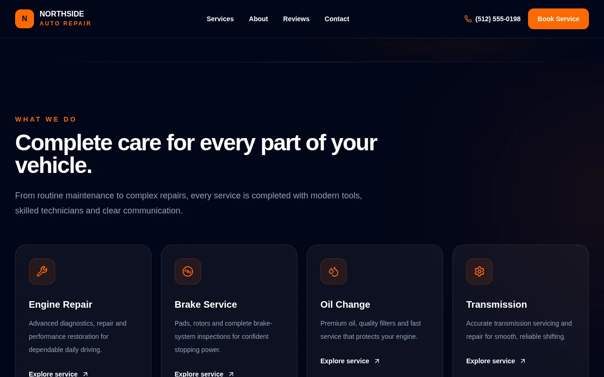
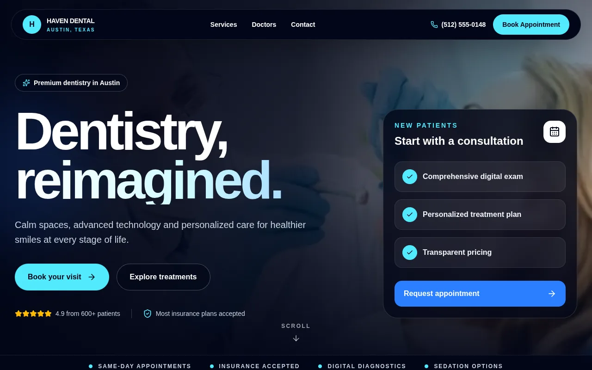
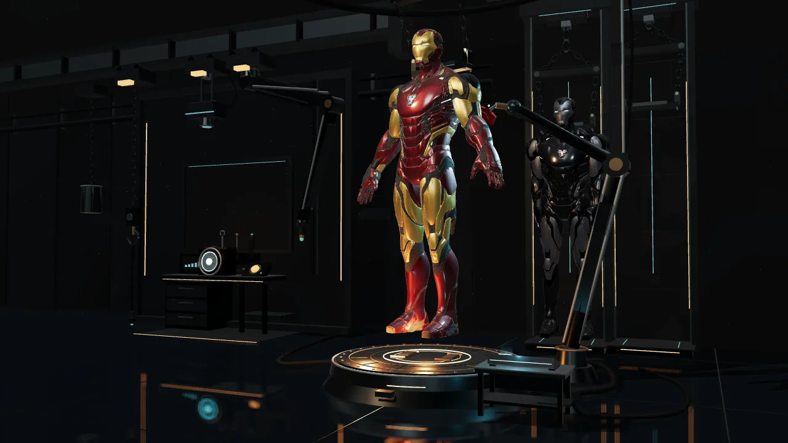

 

---

## 👋 About

I'm a **frontend developer and software engineer**. I build fast, responsive websites and **Telegram bots** for small and local businesses — from the first sketch to a live launch.

My daily stack is **React, TypeScript, Next.js, Vite and Tailwind CSS**, with **Python** for bots and automation, on **Linux**. I use modern AI-assisted workflows to move faster, and I personally review architecture, responsiveness, accessibility and production quality.

## 🧰 Stack

  

## 📊 Languages

  

## 🚀 Selected work

<table>
<tr>
<td width="50%" valign="top">

<h3>🚗 Northside Auto Repair</h3>
Landing page concept for a local auto repair shop: services, booking form, animated stats. 
React · TypeScript · Vite 
<a href="https://northside-auto-repair.vercel.app">Live demo</a> · <a href="https://github.com/332mindset/northside-auto-repair">Code</a>
</td>
<td width="50%" valign="top">

<h3>🦷 Haven Dental</h3>
Landing page concept for a private dental clinic with calm visuals and a clear path to booking. 
React · TypeScript · Tailwind CSS 
<a href="https://haven-dental.vercel.app">Live demo</a> · <a href="https://github.com/332mindset/haven-dental">Code</a>
</td>
</tr>
<tr>
<td width="50%" valign="top">

<h3>🛠 Interactive 3D workshop</h3>
A real-time 3D scene: a suspended armor, robotic arms and a contact hologram. An experiment in WebGL. 
Three.js · GSAP · Vite 
<a href="https://ceo-six-phi.vercel.app">Live scene</a> · <a href="https://github.com/332mindset/CEO">Code</a>
</td>
<td width="50%" valign="top">

<h3>🌌 SkyHypr</h3>
A minimal black &amp; cyan Hyprland desktop setup with custom utilities, animations and scripts. 
Python · Shell · Linux 
<a href="https://github.com/332mindset/SkyHypr">Code</a>
</td>
</tr>
</table>

Northside and Haven are concept projects for fictional businesses.

## 💼 What I build

| | |
|---|---|
| **Landing pages** | One focused page that turns visitors into inquiries. |
| **Business websites** | Multi-page sites with clean design, SEO basics and easy-to-edit content. |
| **Telegram bots** | Order intake, bookings, notifications and support flows in Python. |
| **Redesigns & fixes** | Modern UI, animations and a faster, more accessible experience. |

---

### Have a project in mind?

**[Message me on Telegram](https://t.me/hanaagumori)** · **[Visit the portfolio](https://portfolio-gilt-three-30.vercel.app)** · **[Email](mailto:yarikgladenko2@gmail.com)**

